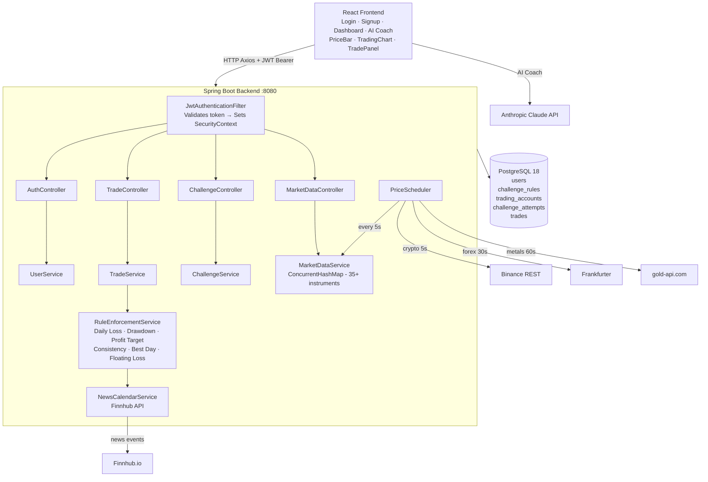
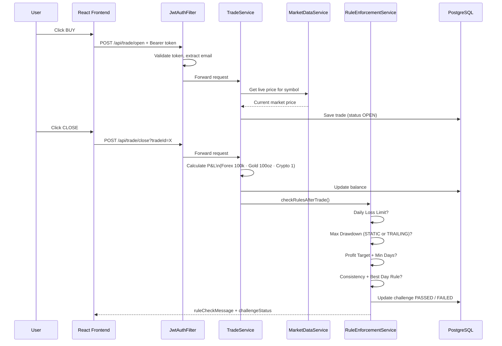
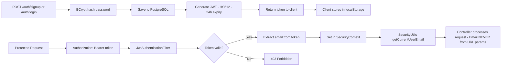
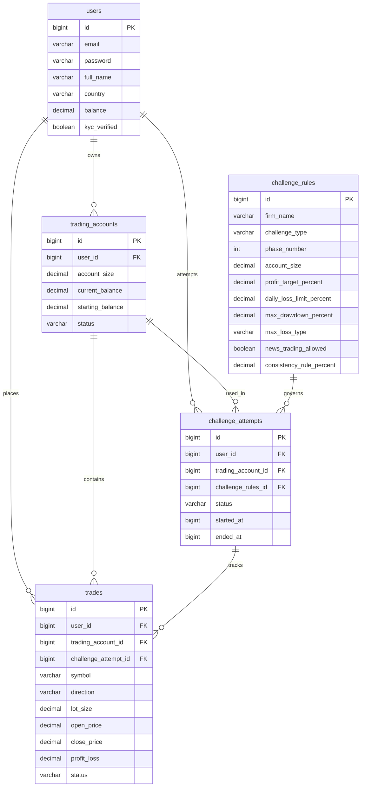

# PropPractice — Prop Firm Trading Challenge Platform

> Practice real prop firm challenges at 100 INR instead of $40–200

A full-stack paper trading platform that simulates real prop firm challenges (FTMO, FundingPips, The5ers, and 9 more) using live market prices but paper money. Built with Java Spring Boot backend and React frontend.

---

## What It Does

Traders pay 100 INR per challenge attempt and get a simulated trading account with the exact same rules as real prop firms. The platform streams real market prices, tracks every trade, and automatically passes or fails the challenge based on the firm's official rules — daily loss limits, max drawdown, profit targets, consistency rules, and more.

---

## Features

- Live prices for 35+ instruments (forex, crypto, gold, silver, oil, indices)
- Paper trading with real P&L calculation per instrument type
- 12 prop firms with 200+ verified challenge configurations
- Rule enforcement engine — auto PASS/FAIL after every trade
- News trading detection via Finnhub Economic Calendar
- JWT authentication with BCrypt password hashing
- AI trading coach powered by Claude (Anthropic)
- Clean REST API with consistent ApiResponse<T> format

---

## Supported Prop Firms

FTMO · FundingPips · Funded Room · Funded Firm · FundedNext · Funded Friday · Blueberry Funded · Goat Funded Trader · The5ers · Alpha Capital · E8 Markets · Maven Trading

---

## Tech Stack

### Backend
- Java 17
- Spring Boot 4.0.6
- Spring Security (JWT, stateless)
- Spring Data JPA + Hibernate
- Flyway (database migrations)
- Spring WebFlux (WebClient for async API calls)
- PostgreSQL 18
- jjwt 0.12.3
- spring-dotenv 4.0.0
- Lombok

### Frontend
- React 18 + Vite
- TanStack React Query
- Axios (with JWT interceptors)
- TradingView Lightweight Charts
- Tailwind CSS v4
- React Router DOM

### Market Data APIs
| Data | Provider | Cost |
|------|----------|------|
| Crypto (7 pairs) | Binance REST | Free |
| Forex (18 pairs) | Frankfurter | Free |
| Gold + Silver | gold-api.com | Free |
| Economic Calendar | Finnhub.io | Free (key needed) |

---

## Architecture

---

## Trade Flow

---

## Security Flow

## Database Schema

